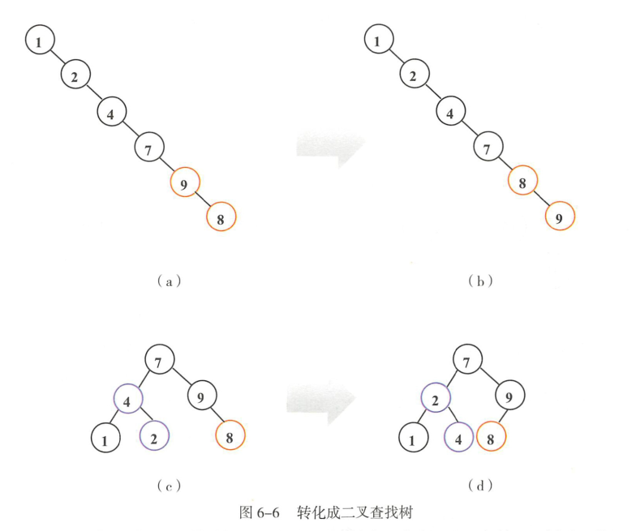
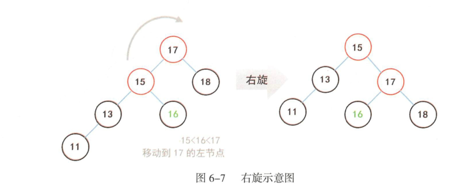
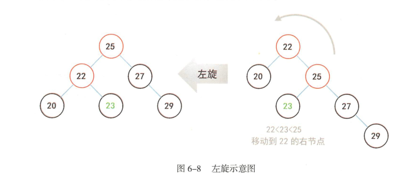

# java基础总结

###### 1.1 对象的概念

- 万物皆对象
- 程序是一组对象，通过信息传递告知彼此该做什么。
- 每个对象都有自己的存储空间，可容纳其他对象。
- 每个对象都有一个类型。每个对象都是某个类的实例。
- 同一类的对象都能接口相同的类型。

###### 1.3 抽象类

- 抽象方法：只有声明，没有具体的实现。
- 如果有一个类含有抽象方法，则这个类抽象类，需由abstract修饰。 特点：
- 抽象方法必须是public或者protected
- 抽象类不能实例化
- 如果子类不是不是抽象类，则必须实现父类的抽象方法

###### 1.3 接口

- 接口中定义的变量被隐式指定为public static final。
- 接口中所有的方法不能有具体的实现。在java8中，可用default关键字在接口中实现默认方法。

###### 1.4 接口与抽象类的区别

- 抽象类中的成员变量可以是各种类型的，而接口中的变量是public static final
- 接口不能有静态代码块以及静态方法，而抽象方法可以
- 一个类只能实现一个抽象类，但是一个类可以实现多个接口。
- 抽象类是对事物的抽象，接口是对行为的抽象

###### 1.5 重写equal()方法的注意点

- 自反性：对于任何非空引用，x.equals(x)应该返回true
- 对称性：对于任何引用x和y，如果x.equals(y)返回为true，那么y.equals(x)也应该返回true
- 传递性：对于任何引用，x，y和z，如果x.equals(y)返回为true，那么y.equals(x)也应该返回true
- 一致性：如果x和y引用的对象没有发生变化，返回调用x.equals(y)应该返回相同的结果
- 对于任何非空引用x，x.equals(null)应该返回false

###### 1.6 对象序列化

对象序列化是以特殊的文件格式存储对象数据的。

###### 1.7 类的加载

Java默认提供的三个ClassLoader：

- BootStrap ClassLoader：称为启动类加载器，是Java类加载层次中最顶层的类加载器，负责加载JDK中的核心类库

- Extension ClassLoader：称为扩展类加载器，负责加载Java的扩展类库，默认加载JAVA_HOME/jre/lib/ext/目下的所有jar。

- App ClassLoader：称为系统类加载器，负责加载应用程序classpath目录下的所有jar和class文件。

  ClassLoader使用的是双亲委托模型来搜索类的（避免重复加载），从上至下搜索。每个ClassLoader实例都有一个父类加载器的引用。 JVM在判定两个class是否相同时，不仅要判断两个类名是否相同，而且要判断是否由同一个类加载器实例加载的。

###### 1.8 hashCode和equals

hashCode和equals用来标识对象，两个方法协同工作可用来判断两个对象是否相等。

1. 如果两个对象的equals的结果是相等的，则两个对象的hashCode的返回结果也必须是相等的。
2. 任何时候覆写equals，都必须同时覆写hashCode。

###### 1.9 fail-fast机制（java.util下的集合类）

集合世界中比较常见的错误检测机制，通常出现在遍历集合元素的过程中。这种机制经常出现在多线程环境下，当前线程会维护一个计数比较器，即expectedModCount，记录已经修改的次数。在进入遍历前，会把实时修改次数modCount赋值给expectedModCount，如果这两个数据不相等 ， 则抛出异常。 

###### 1.10 红黑树

1. 树

   树是一种常用的数据结构，它是一个由有限节点组成的一个具有层次关系的集合，数据就存在树的这些节点中。最顶层还有一个节点，称为根节点。

   - 一个节点，即只有根节点，也可以是一棵树
   - 其中任何一个节点与下面所有节点构成的树称为子树
   - 根节点没有父节点，而叶子节点没有子节点
   - 除根节点外，任何节点有且仅有一个父节点
   - 任何节点可有0~n个子节点

   至多有两个子节点的树称为二叉树。二分法是经典的问题拆解算法，二叉树是近似与二分法的一种数据结构实现，二叉树是高效算法实现的载体。

   

2. 平衡二叉树

   性质：

   - 树的左右高度差不能超过1
   - 任何往下递归的左子树与右子树，必须符合第一条性质
   - 没有任何节点的空树或只有根节点的树也是平衡二叉树

   

3. 二叉查找树

   二叉查找树非常擅长数据查找。二叉查找树额外增加了如下要求：对于任意节点来说，它的左子树所有节点的值都小于它，而他的右子树上所有节点的值都大于它。查找过程从树的跟节点开始，沿着简单的判断向下走，小于节点值的往左边走，大于节点的值往右边走，直到找到目标数据或者到达子节点还未找到。

   遍历所有节点的常用方式有三种：前序遍历，中序遍历，后序遍历。

   - 在任何递归子树中，左节点一定在右节点之前先遍历
   - 前序，中序，后序，仅指根节点在遍历时的位置顺序。

   前序遍历的顺序时根节点，左节点，右节点；中序遍历的顺序时左节点，根节点，右节点；而后序遍历的顺序则时左节点，右节点，根节点。

   二叉查找树由于随着数据不断的增加或删除容易失衡，为了保持二叉树重要的平衡性，有很多算法的实现，如AVL树，红黑树，SBT，Treap（树堆）等。

   

4. AVL树

   AVL树是一种平衡二叉查找树，增加和删除节点后通过树形旋转重新达到平衡。右旋是以某个节点为中心，将它沉入当前右子节点的位置，而让当前的左子节点作为新树的根节点，也称为顺时针旋转；同理，左旋是以某个节点为中心，将它沉入当前左子节点的位置，而让当前右子节点作为新树的根节点，也称为逆时针旋转。

​	

5. 红黑树

   主要特征是在每个节点增加一个属性来表示节点的颜色，可以是红色，也可以是黑色。

   红黑树和AVL树类似，都是在进行插入和删除元素时，通过特定的旋转来保持自身平衡的，从而获得较高的查找性能。与AVL树相比，红黑树并不追求所有递归子树的高度差不超过1，而是保证从根节点到叶子节点的最长路径不超过最短路径的2倍，所以它的最坏运行时间也是O(log n)。红黑树通过重新着色和左右旋转，更加高效的完成了插入和删除操作后的自平衡调整。红黑树本质上还是二叉查找树，它额外引入了5个约束条件。

   - 节点只能是红色或黑色
   - 根节点必须是黑色
   - 所有NIL节点都是黑色的。NIL，即叶子节点下挂的两个虚节点。
   - 一条路径上不能出现相邻的两个红色节点。
   - 在任何递归子树内，根节点到叶子节点的所有路径上包含相同数目的黑色节点。

   即“有红必有黑，红红不相连”，上述5个约束条件保证了红黑树的新增，删除，查找的最坏时间复杂度均为O(log n)。如果一个树的左子节点或右子节点不存在，则均认定为黑色。

   - 节点的父亲是红色，叔叔是红色，则重新着色。
- 节点的父亲是红色，叔叔是黑色，而新节点是父亲的左节点，进行右旋。
   - 节点的父亲是红色，叔叔是黑色的，而新节点是父亲的右节点，进行右旋。

   
   
6. HashMap源码解析

   

   

   

   

