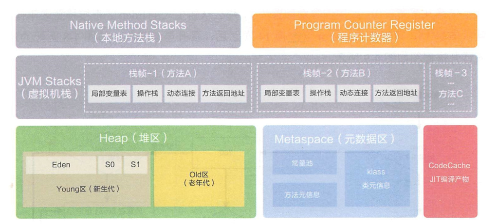
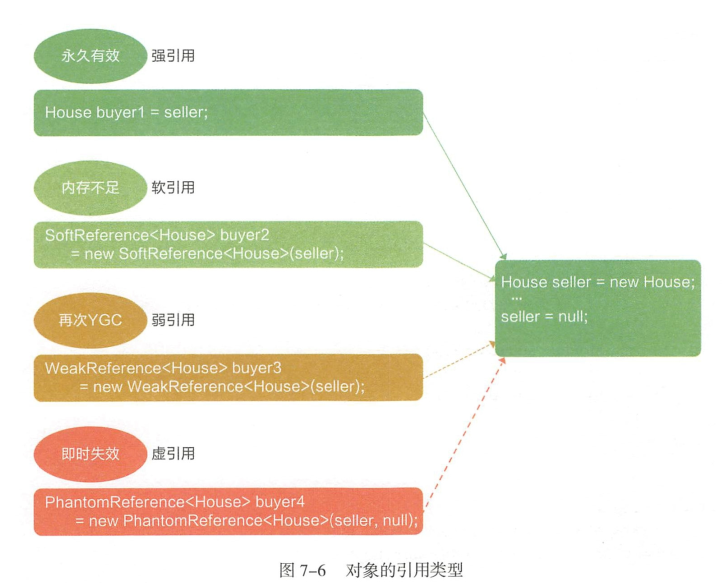

# JVM虚拟机

###### 1.1 程序计数器（线程私有）

当前线程所执行的字节码的行号指示器，每条线程都要有一个独立的程序计数器。（指令的执行都是通过抢占cpu资源的（cpu分配时间片），每个线程可能执行了一段时间后，就被其他线程抢占了资源。所以需要程序计数器来记录当前执行到的行号。）

对于java方法，计数器记录的是虚拟机字节码指令的地址。对于Native方法，则为空。

###### 1.2 虚拟机栈（线程私有）

是描述java方法执行的内存模型。每个方法在执行的同时都会创建一个栈帧，用于存储局部变量表，操作数栈，动态链接，方法出口等信息。每一个方法从调用直至执行完成的过程，就对应一个栈帧在虚拟机栈中入栈到出栈的过程。

栈帧随着方法调用而创建，随着方法结束而销毁。

###### 1.3 本地方法区（线程私有）

类似虚拟机栈。区别在于本地方法栈为Native方法服务。

###### 1.4 堆（运行时数据区，线程共享）

创建的对象和数组都保存在java堆内存中，也是垃圾收集器进行垃圾收集最重要的内存区域。

###### 1.5 方法区/永久代（线程共享）

用于存储JVM加载的类信息，

###### 1.6 垃圾回收算法

- 标记-清除算法：该算法从每个GC Roots出发，依次标记有引用关系的对象，最后将没有被标记的对象清除。此种算法会带来大量的空间碎片，导致需要一个较大连续空时间时容易触发FullGC。
- 标记-整理算法：首先从GC Roots出发标记存活的对象，然后将存活对象整理到内存空间的一端，形成连续的已使用空间，最后把已使用空间之外的部门全部清理掉，这样就不会出现空间碎片的问题。
- “Mark-Copy”算法：为了能够并行的标记和整理将空间分为两块，每次只激活其中一块，垃圾回收时只需要吧存活的对象复制到另一块未激活空间上，将未激活空间标记为已激活，将已激活空间标记为未激活，然后清除原空间中的原对象。为主流的YGC算法进行新生代的垃圾回收。

###### 1.7 垃圾回收器

- serial回收器：主要应用于YGC的垃圾回收器，采用串行单线程的方式完成GC任务。在垃圾回收的某个阶段会暂停整个应用程序的执行。
- CMS回收器：回收停顿时间表较短，目前比较常用的垃圾回收器。他通过初始标记、并发标记、重新标记、并发清楚四个步骤完成垃圾回收工作。由于CMS采用的“标记-清除算法”，因此长生大量的空间碎片。为了解决这个问题，CMS可以通过配置-XX:+UseCMSCompactAtFullCollection参数，强制JVM在FGC完成后对老年代进行压缩，执行一次空间碎片整理。为了较少STW次数，CMS也可以通过配置XX:+UseCMSCompactAtFullCollection=n，即在执行n次FGC后，JVM再在老年代执行空间碎片整理。
- G1：-XX:+UseG1GC。与CMS相比，G1具备压缩功能，能避免碎片问题。GI 将 Java 堆空间分割成了若干相同大小的 区域，即 region ，包括 Eden 、
  Survivor 、 Old 、 Humongous 四种类型。其 其中， Humongous 是特殊的 Old 类型，专门放置大型对象。这样的划分方式意昧着不需要一个连续的内存空间管理对象。 G I 将空间分为多个区域，优先回收垃圾最多的 区域。 GI 采用的是“Mark-copy”，有非常好的空间整合能力，不会产生大量的空间碎片。G I 的一大优势在于可预测的停顿时间，能够尽可能快地在指定时间内完成垃圾回收任务。在 JDKl l 中，已经将 G I 设为默认垃圾回收器 ， 通过 jstat 命令可以查看垃圾回收情况。

###### 1.8引用类型

对象在堆上创建之后所持有的引用其实是一种变量类型，引用之间可以通过赋值构成一条引用链。从GC Roots开始遍历，判断引用是否可达。引用的可达性是判断能否被垃圾回收的基本条件。JVM会据此自动管理内存的分配与回收。但在某些场景下，即使引用可达，也希望能够根据语义的强弱进行有选择的回收，以保证系统的正常运行。根据引用类型语义的强弱来决定垃圾回收的阶段，我们可以把引用分为强引用、弱引用、软引用和虚引用。

- 强引用：如Object obj = new Object()；这样变量声明和定义就会产生对该引用的强引用。只要对象有强引用指向，并且GC Root可达，那么Java内存回收时，即使濒临内存耗尽，也不会回收该对象。
- 软引用：引用力度弱于“强引用”，使用在非必需对象的场景。在即将OOM之前，垃圾回收器会把这些软引用指向的对象的加入回收范围，以获取更多的内存空间，让程序能够继续健康的运行。主要用来缓存服务器中间计算结果及不需要实时保存的用户行为等。
- 弱引用：引用强度较前两者更弱，也是用来描述非必需对象的。如果弱引用指向的对象只存在弱引用这条线路，则在下一次 YGC 时会被回收。
  由于 YGC 时间的不确定性，弱引用何时被回收也具有不确定性。弱引用主要用于指
  向某个易消失的对象，在强引用断开后，此引用不会劫持对象。调用 WeakReference.get（）可能返回 null ，要注意空指针异常。 
- 虚引用:是极弱的一种引用关系，定义完成后，就无法通过该引用获取指向的对象。为一个对象设置虚引用的唯一目的就是希望能在这个对象被回收时收到一个系统通知。虚引用必须与引用队列联合使用，当垃圾回收时，如果发现存在虚引用，就会在回收对象内存前，把这个虚引用加入与之关联的引用队列中。 

