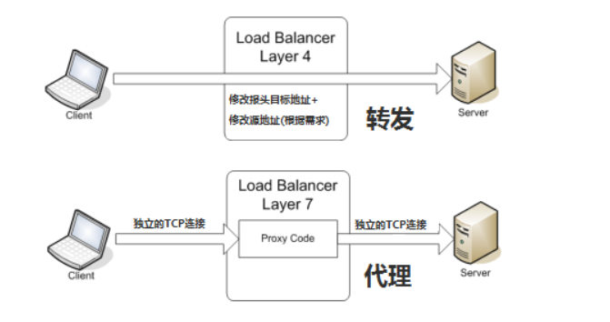

# 负载均衡

###### 1.1 四层负载均衡

负载均衡设备在接收到第一个来自客户端的SYN请求时，即通过上述方式选择一个最佳的服务器，并对报文中目标IP地址进行修改，直接转发给该服务器。TCP的连接建立，即三次握手是客户端和服务器直接建立的，负载均衡设备只是起到一个类似路由器的转发动作。

- F5：硬件负载均衡器，功能好，成本高
- lvs：重量级的四层负载软件。
- nginx：轻量级的四层负载软件，带缓存功能，正则表达式较灵活。
- haproxy：模拟四层转发，较灵活。

1.2 七层负载均衡（内容交换）

所谓七层负载均衡，也称为"内容交换"，也就是主要通过报文中的真正有意义的应用层内容，再加上负载均衡设备设置的服务器选择方式，决定最终决定的内部服务器。

七层应用负载的好处，是使得整个网络更智能化。例如访问一个网站的用户流量，可以通过七层的方式，将对图片类的请求转发到特定的图片服务器并可以使用缓存技术；将对文字类的请求可以转发到特定的文字服务器并可以使用压缩技术。 

实现七层负载均衡的软件有：

- haproxy：天生负载均衡技能，全面支持七层代理，会话保持，标记，路径转移；
- nginx：只在 http 协议和 mail 协议上功能比较好，性能与 haproxy 差不多；
- apache：功能较差
- Mysql proxy：功能尚可。 

1.3 负载均衡算法/策略

- 轮询均衡：来自网络的请求轮流分配给内部中的服务器。
- 权重轮询均衡：根据服务器的不同处理能力，给每个服务器分配不同的权值。
- 随机均衡：随机分配给内部中的多个服务器。
- 权重随机均衡：类似权重轮询均衡，不过在处理请求分担是个随机选择的过程。
- 响应速度均衡：负载均衡设备对内部各服务器发出一个探测请求（例如ping），然后根据内部中各服务器对探测请求的最快响应时间来决定哪一台服务器来响应客户端的服务请求。
- 最少连接数均衡：服务器记录正在处理的连接情况，当有新的服务连接请求时，将把当前请求分配给连接数最少的服务器。适合长时处理的请求服务。
- 处理能力均衡（CPU，内存）：将服务请求分配给内部中处理负荷（根据服务器CPU型号，CPU数量，内存大小以及当前连接数等换算而成）最轻的服务器，由于考虑到了内部服务器的处理能力及当前网络运行状况，结果较精确。
- DNS响应均衡：在此均衡算法下，分处在不同地理位置的负载均衡设备收到同一个客户端的域名解析请求，并在同一时间内把此域名解析成各自相对应服务器的 IP 地址并返回给客户端， 则客户端将以最先收到的域名解析 IP 地址来继续请求服务，而忽略其它的 IP 地址响应。 
- 哈希算法：一致性哈希，相同参数的请求总是发到同一提供者。
- IP地址散列：来自相同客户端的通信能够一直在同一服务器中进行处理。
- URL散列：通过管理客户端请求 URL 信息的散列，将发送至相同 URL 的请求转发至同一服务器的算法。 