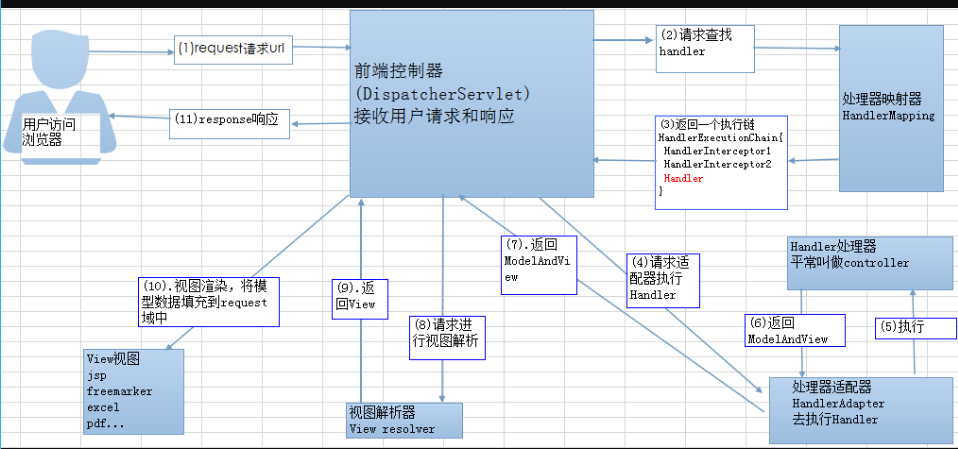

# SpringMVC

###### 1.1 springMVC执行流程

- User向服务器发送request,前端控制Servelt DispatcherServlet捕获;
- DispatcherServlet对请求URL进行解析，调用HandlerMapping获得该Handler配置的所有相关的对象，最后以HandlerExecutionChain对象的形式返回.
- DispatcherServlet 根据获得的Handler，选择一个合适的HandlerAdapter.
- 提取Request中的模型数据，填充Handler入参，开始执行Handler（Controller)
- Handler执行完成后，返回一个ModelAndView对象到DispatcherServlet
- 根据返回的ModelAndView，选择一个适合的ViewResolver
- ViewResolver 结合Model和View，来渲染视图
- 将渲染结果返回给客户端。

###### 1.2 相关组件

- 前端控制器DispatcherServlet：springMVC的入口函数。接收请求，响应结果。
- handlerMapping：根据请求的url查找handler。
- handlerAdapter：按照特定规则（HandlerAdapter要求的规则）去执行handler。适配器模式。
- 处理器handler：开发者定义的处理器。（controller层）
- 视图解析器：进行视图解析，根据逻辑视图名解析成真正的视图（view） View Resolver负责将处理结果生成View视图，View Resolver首先根据逻辑视图名解析成物理视图名即具体的页面地址，再生成View视图对象，最后对View进行渲染将处理结果通过页面展示给用户。
- 视图View：即前端页面